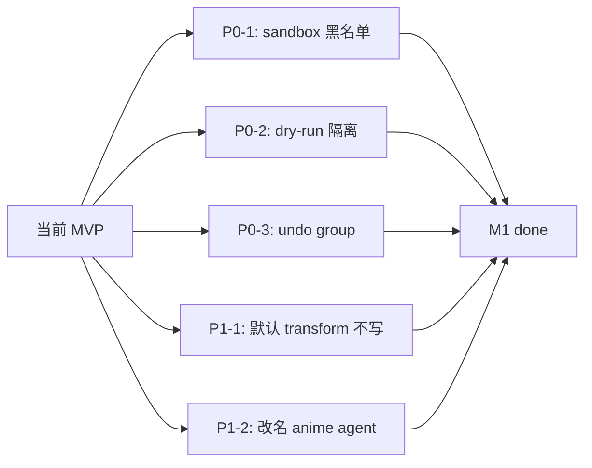

# M1 修复计划 — Reference Scene Composition MVP 兜底

Status: Planned (1–2 天)
Owner: anime agent team
Source of truth: `docs/REQUIREMENTS_reference_scene.md` 第 12 节 M1 行
Last updated: 2026-05-08

> 本文件只列 M1 必做项。M2 (vision) / M3 (layout & camera) / M4 (skill 收尾) / M5
> (Phase 3 闭环) 不在这里展开。每条都标好「为什么」「在哪里改」「怎样验证」。

---

## 0. 总览

M1 目的：让现有 MVP **真的能跑**，把 Phase 1 review 出来的三个会立刻挂的 P0
洞补上，并把所有 user-facing 的 `Copilot` 字样统一到 `anime agent`，避免文档
和代码自称不一致。



---

## 1. P0-1 — `usd_code_tools.py` sandbox 改黑名单

### 为什么

现状 `_safe_builtins` 是白名单，少了 `Exception` / `getattr` / `hasattr` /
`setattr` / `type` / `iter` / `next` 等。LLM 输出的常规 USD 片段（带 try/except、
属性反射）会直接 `NameError`，让 `execute_usd_python` 几乎不可用。

### 在哪里改

文件：`omni/anim/drama/toolset/agent/tools/usd_code_tools.py`

具体：

- 把 `_safe_builtins()` 改成「全 builtins 减去黑名单」：
  - 黑名单 = `{open, eval, exec, compile, input, __import__, breakpoint, quit, exit, help, copyright, credits, license}`
  - `__import__` 仍然指向 `_guarded_import`（保留 import root 校验）。
- `_ALLOWED_IMPORT_ROOTS` 增加 `re` 与 `functools`（常被 USD 片段使用）。
- `_DENIED_IMPORT_ROOTS` 不变。
- `_DENIED_CALL_NAMES` 与 `_validate_code` 不变。

### 怎样验证

1. 写一个最小测试：`execute_usd_python("try:\\n    x = int('a')\\nexcept Exception as e:\\n    print(e)")`，应返回 `ok=True`，stdout 含 `invalid literal`。
2. 写一个 USD 反射片段：`execute_usd_python("for prim in stage.Traverse():\\n    print(prim.GetPath(), getattr(prim, 'GetTypeName', lambda: '?')())")`，应跑通。
3. 写一个攻击片段：`execute_usd_python("import os")`，应在 `_validate_code` 阶段返回 `ok=False, error=Import of 'os' is not allowed`，live stage 不变。

---

## 2. P0-2 — `usd_code_tools.py` dry-run 隔离改 layer transfer

### 为什么

现状 `_create_in_memory_stage_like_current` 用
`new_stage.GetRootLayer().subLayerPaths.append(root_layer.identifier)`：

- 当前 stage 是匿名层（新建未保存的场景，最常见）时，`root_layer.identifier`
  形如 `anon:0xABCDEF:World.usda`，作为 sublayer 路径在大多数 USD 版本里**找不
  回原 layer**，dry-run 看到的是空 stage，保护就破了。
- 即使不是匿名层，sublayer 引用对带 payload / clip 的 stage 也常出错。

### 在哪里改

文件：`omni/anim/drama/toolset/agent/tools/usd_code_tools.py`

具体改 `_create_in_memory_stage_like_current()`：

```python
def _create_in_memory_stage_like_current():
    from pxr import Sdf, Usd, UsdGeom

    current_stage = get_stage()
    if current_stage is None:
        return None

    root_layer = current_stage.GetRootLayer()
    if not root_layer:
        return None

    if root_layer.anonymous:
        # 匿名层：把内容拷到新匿名层，然后基于这层创建 stage
        copied_root = Sdf.Layer.CreateAnonymous(root_layer.GetDisplayName() or "dryrun")
        copied_root.TransferContent(root_layer)
        new_stage = Usd.Stage.Open(copied_root, Sdf.Layer.CreateAnonymous("session"))
    else:
        # 真实磁盘层：复用 layer 但 session 隔离，writes 默认进新 session
        new_stage = Usd.Stage.Open(root_layer, Sdf.Layer.CreateAnonymous("session"))

    # session layer transfer（如果有）
    try:
        session_layer = current_stage.GetSessionLayer()
        if session_layer:
            new_session = new_stage.GetSessionLayer()
            new_session.TransferContent(session_layer)
    except Exception:
        pass

    # up axis / time codes
    try:
        axis = UsdGeom.GetStageUpAxis(current_stage)
        if axis:
            UsdGeom.SetStageUpAxis(new_stage, axis)
    except Exception:
        pass

    try:
        new_stage.SetStartTimeCode(current_stage.GetStartTimeCode())
        new_stage.SetEndTimeCode(current_stage.GetEndTimeCode())
    except Exception:
        pass

    # 把 EditTarget 强制指到新 session，确保 dry-run 写入不会落到磁盘 layer
    try:
        new_stage.SetEditTarget(new_stage.GetSessionLayer())
    except Exception:
        pass

    return new_stage
```

并把 `_prepare_code_for_dry_run` 的字符串替换 **去掉**，改成在 `_execute_code`
里把 `omni.usd.get_context` 整体替换成桩：

```python
def _execute_code(code, stage, max_output_chars):
    from pxr import Gf, Sdf, Usd, UsdGeom, UsdLux, UsdShade

    class _StubContext:
        def get_stage(self):
            return stage

    class _StubOmniUsd:
        @staticmethod
        def get_context():
            return _StubContext()

    globals_dict = {
        "__builtins__": _safe_builtins(),
        "stage": stage,
        "Gf": Gf, "Sdf": Sdf, "Usd": Usd,
        "UsdGeom": UsdGeom, "UsdLux": UsdLux, "UsdShade": UsdShade,
        "json": json,
    }
    # 注入桩，挡住 omni.usd.get_context().get_stage() 这条逃逸路径
    try:
        import omni  # 真的 omni.usd 不会被 stub 替换；只有 dry-run 时主动替
        globals_dict["omni"] = type("omni_stub", (), {"usd": _StubOmniUsd})()
    except Exception:
        pass
    # 后续 exec 不变
```

注意：`omni` 桩**只在 dry-run 路径用**；live 路径仍然用真实 `omni.usd`。所以
`_execute_code` 要加个 `is_dry_run` 形参或者把 globals 构造拆成两份。

### 怎样验证

1. 新建一个新 stage（不保存），dry-run 跑 `print(stage.GetRootLayer().identifier)` 应返回新拷贝的匿名层 id，**不是**原 stage 的匿名 id。
2. dry-run 跑 `stage.DefinePrim("/DryRunOnly")`，然后查 live stage，**不能**有 `/DryRunOnly`。
3. dry-run 跑 `omni.usd.get_context().get_stage().DefinePrim("/Sneak")`，**也不能**让 `/Sneak` 出现在 live stage（桩生效）。
4. live 路径下 `omni.usd.get_context()` 仍然返回真实 `UsdContext`。

---

## 3. P0-3 — `usd_code_tools.py` live exec 套 undo group

### 为什么

现状 `execute_usd_python` 直接 `exec(...)` 写当前 EditTarget，不进 Kit undo 栈，
Ctrl+Z 撤不掉。而 `single_agent.py` system prompt 里告诉用户「lighting 操作可以
通过 `remove_relight_layer` 回滚」，模型会误以为 `execute_usd_python` 也能这样
撤，造成信息错位。

### 在哪里改

文件：`omni/anim/drama/toolset/agent/tools/usd_code_tools.py`

`execute_usd_python` live 段：

```python
try:
    import omni.kit.undo as _undo
    with _undo.group():
        live_result = _execute_code(snippet, stage, cap, is_dry_run=False)
except Exception:
    live_result = _execute_code(snippet, stage, cap, is_dry_run=False)
```

文件：`omni/anim/drama/toolset/agent/agents/single_agent.py`

system prompt 增补一段（在 `# Rules (hard constraints)` 末尾）：

```
- `execute_usd_python` writes go into the active edit target (NOT the relight layer).
  Tell the user to undo with Ctrl+Z, not `remove_relight_layer`. The relight layer
  is only for `create_light` / `modify_light`.
```

### 怎样验证

1. 跑 `execute_usd_python("stage.DefinePrim('/UndoTest')")`，确认 prim 存在；按
   一次 Ctrl+Z（或调 `omni.kit.undo.undo()`），prim 消失。
2. system prompt 中能找到上述新增段落。

---

## 4. P1-1 — `asset_tools.reference_usd_asset` 默认 transform 不写

### 为什么

现状不管用户传不传，都强制 `ClearXformOpOrder` + 写
`(0,0,0)/(0,0,0)/(1,1,1)`。多资产 reference 时全部堆原点，看起来像 reference
失败。这条与「按参考图布局」目标直接冲突。

### 在哪里改

文件：`omni/anim/drama/toolset/agent/tools/asset_tools.py`

`reference_usd_asset` 内：

```python
xformable = UsdGeom.Xformable(prim)

any_transform = (
    translation is not None
    or rotation is not None
    or scale is not None
)
if any_transform:
    xformable.ClearXformOpOrder()
    if translation is not None:
        xformable.AddTranslateOp().Set(Gf.Vec3d(*_vec3(translation, 0.0)))
    if rotation is not None:
        xformable.AddRotateXYZOp().Set(Gf.Vec3f(*_vec3(rotation, 0.0)))
    if scale is not None:
        xformable.AddScaleOp().Set(Gf.Vec3f(*_vec3(scale, 1.0)))
# else: 完全不动 xform op，让 reference 进来的资产自带 transform 生效
```

返回值里，`translation` / `rotation` / `scale` 在未设置时返回 `null` 或省略，
不再返回伪造的零值，否则 verify 阶段读回会让 agent 困惑。

### 怎样验证

1. `reference_usd_asset(asset_url=..., prim_path="/World/Assets/Foo")`：调用后
   `inspect_prim("/World/Assets/Foo")` 看不到 `xformOpOrder` 上由本次新增的 op。
2. `reference_usd_asset(asset_url=..., translation=[1,2,3])`：只有 translateOp。
3. 三参数全传：三 op 都写。

---

## 5. P1-2 — 把 `Copilot` 字样统一改为 `anime agent`

### 为什么

需求文档已统一称呼为 `anime agent`，但代码里两处仍是 `Copilot`，自称会和文档
对不上，用户 / 协作者会困惑。

### 在哪里改

文件 1：`omni/anim/drama/toolset/agent/agents/single_agent.py`

```diff
- You are "Anim Drama Toolset Copilot", an expert assistant embedded in a NVIDIA Omniverse \
+ You are the "anime agent", an expert assistant embedded in a NVIDIA Omniverse \
  Kit extension for animation / drama lighting / rendering / camera / keyframe-animation tasks.
```

文件 2：`config/extension.toml`

```diff
- - AI Copilot: 类 ChatUSD 的侧栏对话 Agent，支持 Kimi K2.6 / Gemini / OpenAI 兼容后端，
+ - anime agent: 类 ChatUSD 的侧栏对话 Agent，支持 Kimi K2.6 / Gemini / OpenAI 兼容后端，
   用自然语言调用上述工具（Tool Use / Function Calling），带审批卡片与安全门控
```

`keywords` 里的 `"copilot"` 改成 `"anime-agent"`：

```diff
- "agent", "copilot", "chatusd", "tool-use",
+ "agent", "anime-agent", "chatusd", "tool-use",
```

### 怎样验证

1. `rg "Copilot|AI Copilot"` 在仓库内 `Omniverse-anim-toolset/` 子树下应只剩
   docs / changelog / 历史 SKILL 里的引用（如有），代码与 system prompt 不再
   出现。
2. 启动 extension，问 agent「who are you」，应自称 `anime agent`。

---

## 6. 最小回归清单

完成 M1 后，过一遍这套测试再合：

- [ ] `execute_usd_python` 跑得了 `try/except Exception` 与 `getattr/hasattr` 片段。
- [ ] `execute_usd_python` 拒绝 `import os` / `open(...)` / `eval(...)`。
- [ ] dry-run 不会污染 live stage（包括通过 `omni.usd.get_context()` 的逃逸尝试）。
- [ ] live `execute_usd_python` 后 Ctrl+Z 能回退。
- [ ] `reference_usd_asset` 在不传 transform 时保留资产原 transform。
- [ ] `reference_usd_asset` 传 transform 时按预期写入。
- [ ] system prompt 与 extension.toml 不再含 `Copilot`。
- [ ] agent 自称 `anime agent`。

---

## 7. 不做的事

以下都属于 M2/M3 范围，本里程碑**不**碰：

- 新增 `describe_reference_image`（M2）。
- 新增 `propose_layout` / `pick_best_asset` / `create_camera_for_view`（M3）。
- 修 `select_new` 走 `omni.kit.commands.execute("SelectPrims")`（可放 M3）。
- 修 workflow.md 的 ground plane 例子（Cube → Plane / Mesh，可放 M4）。
- vision / layout / file picker 配置（M2/M3 各自加）。
