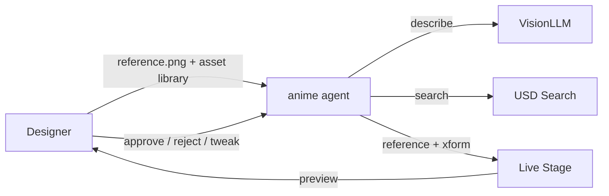
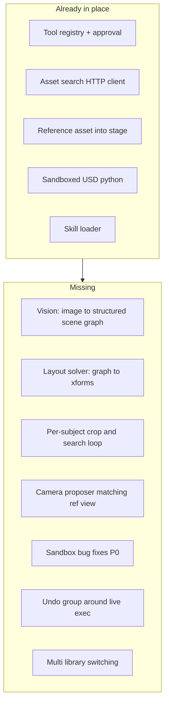
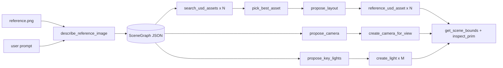
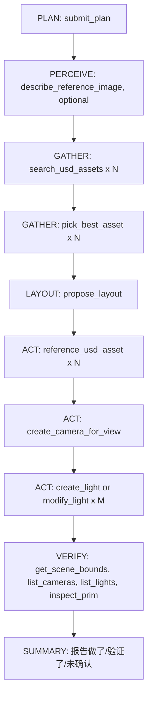

# 参考图驱动 USD 场景自动配置 anime agent — 总需求文档

Status: Draft v1 (Phase 2 起点)
Owner: anime agent team
Last updated: 2026-05-08

> 本文档是「参考图 + 资产库 → USD 场景自动配置」这条 use case 的单一事实来源。
> 后续每条 PR / SKILL / system prompt 改动都应该能映射回本文里的某一节。

---

## 1. 目标 (Goal)

让设计师 / 导演在 Omniverse 内 **给 anime agent 一张参考图 + 一个资产库**，anime agent 自动产出一个 **结构基本对位、可继续手工微调** 的 USD 场景（主体、环境、相机、主光），而不是要求 anime agent 像素级复刻。

**北极星指标**：从拿到参考图到 viewport 出现「主体 + 环境 + 相机 + 关键光」的可视雏形 ≤ 3 分钟，且后续每步可被用户审批 / 撤销。

---

## 2. 范围 (Scope)

### 2.1 范围内 (In Scope, Phase 2)

- 场景搭建 (composition)：从资产库挑资产 → reference 进 stage → 粗略空间布局。
- 布光雏形：key / fill / DomeLight，倾向于改已有灯光而不是新建。
- 相机视角匹配：根据参考图角度 / framing 给一个对位相机。
- 可解释的 agent 流程：plan → perceive → gather → act → verify → summary 五段，每个 mutate 都能审批 / 拒绝 / 撤销。
- 一份 SKILL 把上述固化成「reference-scene-composition」工作手册，agent 触发后能 `read_skill` 拉到。

### 2.2 非范围 (Out of Scope)

- 动作 / 动画的复刻；自动 IK / 绑定 / retarget。
- 材质材球级别的 1:1 还原。
- 物理仿真稳定摆放 (rigid body settle)。
- 跨 layer 的复杂 composition arc 操作。

### 2.3 推迟到 Phase 3

- 「渲染 → 对比 → 再调整」闭环（需要 `render_viewport_thumbnail` 与第二轮 `describe_reference_image` 比对）。
- 多资产库（list of `search_path`）切换。
- file picker UI 入口（暂时只支持填路径字符串）。

---

## 3. 用户故事 (User Stories)



- **US1**：我贴一张图 + 一句话，anime agent 给我一个文字版的「它看到了什么」。
- **US2**：anime agent 按主体逐项搜资产，每个主体给候选 (≤ 5)，我点选一个。
- **US3**：anime agent 按主体粗略空间关系摆进 stage，转 / 缩比例合理。
- **US4**：anime agent 加一个相机和一组主光，构图基本对位。
- **US5**：每个 mutate 步骤都能拒绝 / 撤销，全部走现有审批卡片。

---

## 4. 现有底座 (Reuse, 不动)

| 模块 | 文件 | 用途 |
|---|---|---|
| Agent 循环 | `omni/anim/drama/toolset/agent/network_node.py` | 五阶段 plan / gather / act / verify / summary、approval、verify hint 注入 |
| 工具注册 | `omni/anim/drama/toolset/agent/tool_registry.py` | `@tool`、权限、phase_hint、verify_with |
| 默认 agent | `omni/anim/drama/toolset/agent/agents/single_agent.py` | system prompt + 全工具暴露 |
| 现有工具 | `tools/scene_tools.py`、`tools/lighting_tools.py`、`tools/planning_tools.py`、`tools/usd_introspection.py`、`tools/kit_introspection.py`、`tools/skill_tools.py` | 查询、灯光、Kit 命令、skill 检索 |
| Skill 系统 | `omni/anim/drama/toolset/agent/skills/` | reference-scene-composition 等 |
| MCP 桥接 | `omni/anim/drama/toolset/agent/mcp/` | 可选的外部 MCP server |

---

## 5. MVP 现状盘点 (本轮已落)

- `tools/asset_tools.py` 提供 `search_usd_assets` / `reference_usd_asset`：可用，待修。
- `tools/usd_code_tools.py` 提供 `execute_usd_python`：可用，但 sandbox / dry-run / undo 三个洞要补 (P0)。
- `skills/reference-scene-composition/`：workflow 已写，部分代码示例待修（如 `UsdGeom.Cube` 当地面）。
- `config/extension.toml` 加了 `agent.usd_search.*` 配置：OK。
- `agents/single_agent.py` system prompt 已介绍新工具：需要补「职责边界」段，并把自称从 `Anim Drama Toolset Copilot` 统一改为 `anime agent`。

---

## 6. 能力缺口 (Gap Analysis)



简单表述：**底座工具够了，但缺「图 → 文字 scene graph」与「scene graph → 坐标」两座桥**。中间这两步缺位时，agent 只能瞎猜布局，效果不收敛。

---

## 7. 模块拆分 (Phase 2 架构)



### 7.1 PERCEIVE 层 (新增)

- 工具：`describe_reference_image(image_path: str, focus: str = "general") -> SceneGraph`，`focus` 取值 `general | subjects_only | lighting`。
- 实现：调一个 vision LLM (默认 Gemini 多模态，回退 NVIDIA NIM VLM；走 `agent.vision.*` 配置)。
- **设计取舍 (路径 A)**：独立 vision tool 输出固定 JSON，不动现有 `messages.py` / backend / UI。理由：风险最低、≤1 周可落、效果足够撑起 MVP。后期再演进到 `messages.py` 多模态 (路径 B)。
- 输出 schema (固定，便于下游消费)：

```json
{
  "subjects": [
    {
      "label": "wooden chair",
      "search_queries": ["wooden chair", "rustic chair"],
      "rough_position": "front-left",
      "rough_scale": "human",
      "facing": "camera"
    }
  ],
  "environment": {
    "label": "indoor wooden cabin",
    "search_queries": ["wooden cabin interior", "log cabin room"]
  },
  "camera": {
    "angle_deg_pitch": -10,
    "framing": "medium",
    "fov_estimate_deg": 35
  },
  "lighting": {
    "key": {
      "direction": "left",
      "color_kelvin": 4500,
      "mood": "warm"
    },
    "ambient": {
      "hdri_hint": "warm_sunset"
    }
  }
}
```

枚举值约束（agent 判逻辑要照这套来）：

- `rough_position`：`front-left | front-center | front-right | center-left | center | center-right | back-left | back-center | back-right`
- `rough_scale`：`small | human | large | xl`
- `facing`：`camera | left | right | away`
- `framing`：`close | medium | wide`
- `lighting.key.direction`：`left | right | top | back | front`
- `lighting.key.mood`：`warm | neutral | cool`

### 7.2 GATHER / SEARCH 层 (修补)

- `search_usd_assets`：
  - 加入参 `search_path`（per-call override，覆盖 carb settings 默认值）。
  - 加入参 `top_k_per_query` (默认 5)。
  - 加入参 `min_score`（用于过滤明显不沾边的结果，可选）。
- 新增 `pick_best_asset(subject_label: str, candidates: list, criteria: str = "") -> chosen_url`：让模型把「五选一」这件事下沉到工具层，便于 UI 展示选中过程；READ_ONLY，只是包一层结构化输出。

### 7.3 LAYOUT 层 (新增)

- 工具：`propose_layout(scene_graph: dict) -> [{"label", "translate", "rotate_y", "scale"}, ...]`，READ_ONLY。
- **设计取舍**：规则驱动而非 LLM 驱动布局，原因：可解释、可复现、不会因 prompt 漂移崩。
- 实现要点：
  - 按当前 stage 的 `UpAxis` 自适应 (Y-up / Z-up)。
  - 9 宫格映射：`rough_position` → 相对 (x, z) 比例，例如 `front-left = (-0.4, +0.4)`。
  - `rough_scale` 映射到 stage 半径 ratio（依赖 `get_scene_bounds` 拿当前场景规模；新场景给一个默认基准 5m）。
  - 主体之间按 bbox 间距 ≥ `agent.layout.spacing_factor`（默认 1.2）做贪心 AABB push 避免重叠。
  - `facing` 映射成 `rotate_y`：camera = 0°, left = -90°, right = 90°, away = 180°。

### 7.4 ACT 层 (修补 + 新增)

- `reference_usd_asset` (修补)：当 `translation` / `rotation` / `scale` 三者都为 `None` 时，**完全不写 xform op**，让资产保留原 transform。多资产堆原点的问题靠这条解决。
- `execute_usd_python` (P0 修补)：
  - sandbox 改 **黑名单**：保留全 builtins 减去 `{open, eval, exec, compile, input, __import__, breakpoint, quit, exit}`。原白名单导致 `Exception / getattr / hasattr / setattr / type / iter / next` 不可用，正常 USD 片段会 `NameError`。
  - dry-run 改 `Usd.Stage.Open(root_layer)`；当 root_layer 是匿名层（新场景未保存常见）时改 `Usd.Stage.CreateInMemory()` + `TransferContent`，不再用 `subLayerPaths.append(identifier)`（匿名层 identifier 不可靠）。
  - live 用 `omni.kit.undo.group("[execute_usd_python] {snippet hash}")` 包住，进入 Kit 全局 undo 栈。
  - 字符串替换 `omni.usd.get_context().get_stage()` → `stage` 改成 **注入桩函数**：把 `omni.usd.get_context` 替成本地 wrapper，回 dry-run stage。原字符串替换会被变量别名 / `__import__` 之类绕过。
  - import root 白名单加 `re`、`functools`。
- 新增 `create_camera_for_view(scene_graph_camera: dict, framing_target_path: str = "/World/Assets") -> camera_path`：把「按参考图视角建相机」封成专用工具，不让模型每次手写 `UsdGeom.Camera.Define(...)` + `AddRotateXYZOp(...)`。

### 7.5 VERIFY 层 (复用)

- 复用 `get_scene_summary` / `inspect_prim` / `get_scene_bounds` / `list_lights` / `list_cameras`。
- Phase 3 加 `render_viewport_thumbnail(camera_path, resolution=512) -> image_path`，把渲出的图反喂 `describe_reference_image` 做对比，闭环。

---

## 8. 完整工具矩阵 (Phase 2 目标)

### READ_ONLY (auto-run)

`describe_reference_image`、`search_usd_assets`、`pick_best_asset`、`propose_layout`、`get_scene_summary`、`get_scene_info`、`get_geometry_overview`、`inspect_prim`、`get_scene_bounds`、`get_selection`、`list_lights`、`list_cameras`、`get_camera_info`、`list_skills`、`search_skills`、`read_skill`、`list_kit_commands`、`get_kit_command_doc`、`list_animated_prims`、`get_time_samples`、`list_prims_by_type`、`search_prim_paths`、`get_stage_metadata`、`get_relight_layer_info`、`get_light_link_info`、`get_light_link_targets`、`get_light_info`、`get_all_lights`、`get_light_details`

### MUTATE (审批)

`submit_plan`、`reference_usd_asset`、`execute_usd_python`、`create_light`、`modify_light`、`create_light_link`、`remove_light_link`、`create_shadow_link`、`toggle_relight_layer`、`remove_relight_layer`、`create_camera_for_view`、`execute_kit_command`

### DESTRUCTIVE (默认禁)

`delete_light`

> 命名规则：所有新增工具必须带 `verify_with` 列表（搭配 `tool_registry.ToolDef.verify_with`），让 agent 在 mutate 后能拿到 `__verify_hint__`。

---

## 9. Agent 工作流 (固化到 SKILL `reference-scene-composition`)



详见 [agent/skills/reference-scene-composition/workflow.md](../omni/anim/drama/toolset/agent/skills/reference-scene-composition/workflow.md)。

工作流硬约束：

1. **PLAN 不可跳**：用户一旦给图或要 mutate，先 `submit_plan` 列主体清单 + 计划。
2. **PERCEIVE 仅当有 `image_path`**：纯文字描述时跳过，省一次 vision 调用。
3. **GATHER 与 LAYOUT 都是 READ_ONLY**：先把方案算清楚再请求审批。
4. **ACT 顺序固定**：先 reference 资产、再相机、再灯光，避免相机看不到资产 / 灯光打空气。
5. **VERIFY 强制**：每个 mutate 工具的 `verify_with` 必须真调一次。

---

## 10. 安全 & 撤销 (硬约束)

- `execute_usd_python` 必须 `omni.kit.undo.group()` 包裹 (P0)。
- `reference_usd_asset` 已经天然由 USD 内置 undo 支持 (UsdGeom.Xform.Define + AddReference)，但建议改走 `omni.kit.commands.execute("CreatePrimWithDefaultXform")` + reference 操作以统一进 undo 栈。
- system prompt 增补一段：

  > `execute_usd_python` writes go into the active edit target (NOT the relight layer). Undo via Ctrl+Z, not `remove_relight_layer`. Light edits via `create_light` / `modify_light` still go into the relight layer as before.

- sandbox 黑名单调整 (P0)：解掉 `Exception / getattr / hasattr / setattr / type / iter / next` 之类常见 builtins 限制；保留对 `open / eval / exec / compile / input / __import__ / breakpoint` 的拦截；`_DENIED_IMPORT_ROOTS` 不变。
- `select_new` 改走 `omni.kit.commands.execute("SelectPrims", paths=[...])`，避免不同 Kit 版本 `set_selected_prim_paths(paths, flag)` 第二参语义不一致。

---

## 11. 配置项 (`config/extension.toml`)

已有：

- `exts."omni.anim.drama.toolset".agent.usd_search.host_url`
- `exts."omni.anim.drama.toolset".agent.usd_search.api_key`
- `exts."omni.anim.drama.toolset".agent.usd_search.username`
- `exts."omni.anim.drama.toolset".agent.usd_search.search_path`

Phase 2 新增：

- `exts."omni.anim.drama.toolset".agent.vision.provider`：`gemini` | `openai_compat` | `nvidia_nim`，默认 `gemini`。
- `exts."omni.anim.drama.toolset".agent.vision.model`：模型名，例如 `gemini-2.0-flash`。
- `exts."omni.anim.drama.toolset".agent.vision.api_key`：留空时回退到 `agent.<provider>.api_key`、`GEMINI_API_KEY`、`NVIDIA_API_KEY`。
- `exts."omni.anim.drama.toolset".agent.layout.spacing_factor`：默认 `1.2`。
- `exts."omni.anim.drama.toolset".agent.layout.up_axis`：`auto` | `Y` | `Z`，默认 `auto`。

---

## 12. 里程碑 (建议节奏)

| 里程碑 | 工作量 | 内容 |
|---|---|---|
| **M1 (P0, 1–2 天)** | 修 `usd_code_tools.py` sandbox 黑名单、dry-run 隔离、undo group；修 `asset_tools.reference_usd_asset` 默认 transform；把 `Copilot` 字样统一改为 `anime agent` (含 `agents/single_agent.py` system prompt 第一行 `You are "Anim Drama Toolset Copilot"` 与 `config/extension.toml` `description` 中的 `AI Copilot`)。让现有 MVP 不挂。 |
| **M2 (2–3 天)** | 新增 `tools/vision_tools.py` 实现 `describe_reference_image`，输出 schema 校验；mock vision response 写一份 `tests/agent/test_describe_reference_image.py`；扩展 `extension.toml` 的 `agent.vision.*` 配置；`single_agent.py` system prompt 介绍新工具。 |
| **M3 (2–3 天)** | 新增 `tools/layout_tools.py` 实现 `propose_layout` 与 `pick_best_asset`；新增 `create_camera_for_view`；扩 `agent.layout.*` 配置；workflow.md 引用新工具。 |
| **M4 (1 天)** | `skills/reference-scene-composition/` 全套刷新；`single_agent.py` system prompt 收尾；端到端跑一个 indoor demo + 一个纯文字 demo。 |
| **M5 (Phase 3)** | `render_viewport_thumbnail` + 反喂闭环；多 search_path 切换；file picker UI 入口。 |

---

## 13. 验收标准 (Demo 用例)

| 用例 | 输入 | 期望 |
|---|---|---|
| 客厅 + 沙发 + 茶几 + 落地灯 (室内暖光) | `livingroom_ref.png` + "make a cozy living room like this" | scene 内 ≥ 3 个 referenced asset；1 个相机大致对位；1 个 RectLight 暖光；viewport 一眼能认出主题 |
| 户外 + 树 + 角色 (无参考图，仅文字) | "outdoor forest scene with one anime character" | 跳过 PERCEIVE；GATHER 文本搜索 → LAYOUT → ACT 全过 |
| sandbox 边界 | LLM 写 `import os; os.system("rm -rf /")` | `_validate_code` 阶段直接报错；live stage 完全不动；返回错误信息给 agent 让它修 |
| undo 回滚 | 跑完一个 ACT，按 Ctrl+Z | 资产 / 相机 / 灯光全部按调用顺序逆向回退；relight layer 单独可 toggle |

---

## 14. 不会做 / 留给后续

- 自动 IK retarget。
- 物理仿真稳定摆放 (rigid body settle)。
- 跨 layer 复杂 composition arc 操作。
- 镜头动画 keyframe 自动生成。
- 跨张图的「故事板批量配置」(留 Phase 4)。

---

## 15. 开放问题 (Open Questions)

- (Q1) Vision provider 默认走哪家？建议默认 Gemini 多模态（已有 backend），回退 NVIDIA NIM VLM。**待确认**。
- (Q2) `search_path` 是否支持多库？建议 Phase 2 单库 + per-call override，多库等 Phase 3。
- (Q3) `propose_layout` 用规则还是让 LLM 给坐标？建议规则 (Phase 2)，规则不够再补 LLM finetune (Phase 3+)。
- (Q4) 是否给 user UI 入口选 reference image (拖拽 / file picker)？目前只能填路径字符串，建议 Phase 2 末加 file picker。
- (Q5) `reference_usd_asset` 是否走 `omni.kit.commands` 而不是直接 `Sdf` API，以统一 undo？倾向是。

---

## 16. 文档 / 入口索引

- 本文件：`docs/REQUIREMENTS_reference_scene.md`
- 工作流 SKILL：`omni/anim/drama/toolset/agent/skills/reference-scene-composition/SKILL.md` 与 `workflow.md`
- M1 修复清单：`docs/CHANGELOG_M1_plan.md`
- 现有工具入口：`omni/anim/drama/toolset/agent/tools/__init__.py` 的 `register_all()`
- system prompt：`omni/anim/drama/toolset/agent/agents/single_agent.py`
- 配置：`config/extension.toml`
